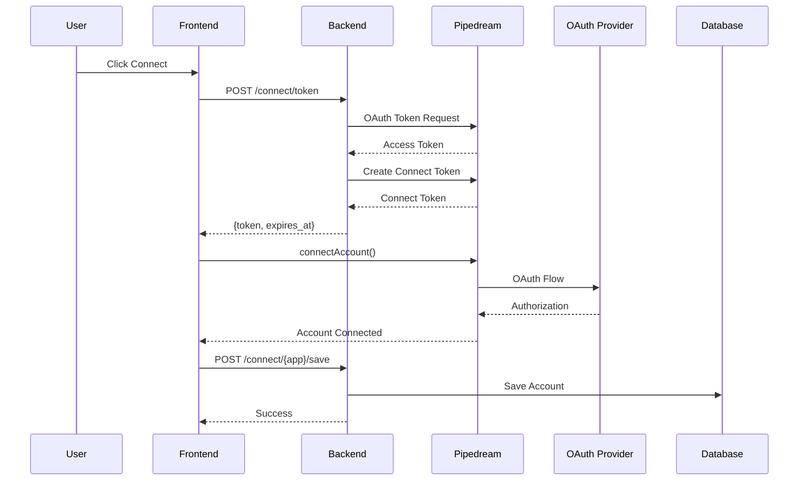

# Pipedream Connect Integration

## Overview

Integration of Pipedream Connect for secure OAuth-based account connections. Allows users to connect third-party accounts (Gmail, Slack, GitHub, etc.) through Pipedream's managed OAuth flow.

## Architecture



## Setup

### Environment Variables

```env
PIPEDREAM_CLIENT_ID=your_client_id
PIPEDREAM_CLIENT_SECRET=your_client_secret
PIPEDREAM_PROJECT_ID=proj_xxxxx
PIPEDREAM_PROJECT_ENVIRONMENT=development
PIPEDREAM_BASE_URL=https://api.pipedream.com/v1
```

### Configuration

**File: `config/services.php`**

```php
'pipedream' => [
    'client_id' => env('PIPEDREAM_CLIENT_ID'),
    'client_secret' => env('PIPEDREAM_CLIENT_SECRET'),
    'project_id' => env('PIPEDREAM_PROJECT_ID'),
    'project_environment' => env('PIPEDREAM_PROJECT_ENVIRONMENT', 'development'),
    'base_url' => env('PIPEDREAM_BASE_URL', 'https://api.pipedream.com/v1'),
],
```

### Dependencies

```bash
npm install @pipedream/sdk
```

## Authentication Flow

Two-step process:

1. **OAuth Token**: Authenticate with Pipedream using client credentials
2. **Connect Token**: Create short-lived token for frontend SDK

**Key Requirements:**
- `project_environment` must be in OAuth token request body
- `X-PD-Environment` header must be set in Connect token request
- Token callback must return `{ token: string, expiresAt: Date }` object

## Frontend Implementation

### Token Callback

The Pipedream SDK requires a token callback that returns an object, not just a string:

```typescript
const fetchToken = async (): Promise<{ token: string; expiresAt: Date }> => {
    // Return cached token if available
    if (cachedToken) {
        return {
            token: cachedToken,
            expiresAt: new Date(Date.now() + 60 * 60 * 1000),
        };
    }
    
    // Fetch from backend
    const response = await fetch('/connect/token', {
        method: 'POST',
        headers: {
            'Content-Type': 'application/json',
            'X-XSRF-TOKEN': getCsrfToken(),
        },
        credentials: 'same-origin',
    });
    
    const data = await response.json();
    if (data.success && data.token) {
        cachedToken = data.token;
        return {
            token: data.token,
            expiresAt: data.expires_at ? new Date(data.expires_at) : new Date(Date.now() + 60 * 60 * 1000),
        };
    }
    throw new Error(data.error || 'Failed to get token');
};
```

### Client Initialization

```typescript
const client = new PipedreamClient({
    projectEnvironment: 'development',
    externalUserId: userId.toString(),
    tokenCallback: fetchToken,
});
```

### Connecting Accounts

```typescript
client.connectAccount({
    app: 'gmail',
    onSuccess: async (account) => {
        // Save to backend
        await fetch('/connect/gmail/save', {
            method: 'POST',
            headers: { 'Content-Type': 'application/json', 'X-XSRF-TOKEN': getCsrfToken() },
            body: JSON.stringify({
                connection_id: account.id,
                external_user_id: userId,
                metadata: account,
            }),
        });
    },
    onError: (err) => {
        console.error('Connection error:', err);
    },
});
```

## Backend Implementation

### Token Generation

**Route: `POST /connect/token`**

```php
public function getToken(Request $request): JsonResponse
{
    // Step 1: Get OAuth access token
    $oauthResponse = Http::asJson()->post('/oauth/token', [
        'grant_type' => 'client_credentials',
        'client_id' => $clientId,
        'client_secret' => $clientSecret,
        'scope' => 'connect:accounts:read connect:accounts:write connect:tokens:create',
        'project_environment' => $projectEnvironment, // Required in body
    ]);
    
    $accessToken = $oauthResponse->json()['access_token'];
    
    // Step 2: Create Connect token
    $response = Http::withHeaders([
        'Authorization' => 'Bearer ' . $accessToken,
        'X-PD-Environment' => $projectEnvironment, // Required in header
    ])->post('/connect/tokens', [
        'external_user_id' => (string) $user->id,
        'project_id' => $projectId,
        'allowed_origins' => [config('app.url')],
    ]);
    
    return response()->json([
        'success' => true,
        'token' => $response->json()['token'],
        'expires_at' => $response->json()['expires_at'],
    ]);
}
```

### Saving Connections

**Route: `POST /connect/{app}/save`**

```php
public function saveConnection(Request $request, string $appName): JsonResponse
{
    $accountId = $request->input('connection_id');
    $accountDetails = $this->getAccountFromPipedream($accountId);
    
    ConnectedAccount::updateOrCreate(
        ['user_id' => $user->id, 'app_name' => $appName],
        [
            'pipedream_account_id' => $accountId,
            'external_user_id' => $request->input('external_user_id'),
            'metadata' => $accountDetails,
            'is_active' => true,
        ]
    );
    
    return response()->json(['success' => true]);
}
```

### Making API Requests

**Route: `POST /connect/{app}/request`**

```php
public function makeRequest(Request $request, string $appName): JsonResponse
{
    $account = ConnectedAccount::where('user_id', $user->id)
        ->where('app_name', $appName)
        ->where('is_active', true)
        ->first();
    
    $accessToken = $this->getOAuthAccessToken();
    
    $response = Http::withHeaders([
        'Authorization' => 'Bearer ' . $accessToken,
        'X-PD-Environment' => $projectEnvironment,
    ])->post('/connect/' . $projectId . '/accounts/' . $account->pipedream_account_id . '/proxy', [
        'method' => $request->input('method'),
        'url' => $request->input('endpoint'),
        'body' => $request->input('body', []),
    ]);
    
    return response()->json([
        'success' => true,
        'data' => $response->json(),
    ]);
}
```

## Database Schema

```sql
CREATE TABLE connected_accounts (
    id BIGINT UNSIGNED PRIMARY KEY,
    user_id BIGINT UNSIGNED NOT NULL,
    app_name VARCHAR(255) NOT NULL,
    pipedream_account_id VARCHAR(255) NOT NULL,
    external_user_id VARCHAR(255) NOT NULL,
    metadata JSON NULL,
    is_active BOOLEAN DEFAULT TRUE,
    created_at TIMESTAMP NULL,
    updated_at TIMESTAMP NULL,
    UNIQUE KEY (user_id, app_name),
    FOREIGN KEY (user_id) REFERENCES users(id) ON DELETE CASCADE
);
```

## API Endpoints

| Method | Endpoint | Description |
|--------|----------|-------------|
| POST | `/connect/token` | Generate Connect token for frontend |
| POST | `/connect/{app}/save` | Save connected account |
| GET | `/connect/accounts` | List user's connected accounts |
| POST | `/connect/{app}/request` | Make API request via connected account |

## Common Issues

### Token Callback Returns Undefined

**Problem**: SDK receives `undefined` token

**Solution**: Token callback must return `{ token: string, expiresAt: Date }` object, not just a string.

### Environment Missing Error

**Problem**: `Failed to connect: Environment missing`

**Solution**: 
- Include `project_environment` in OAuth token request body
- Set `X-PD-Environment` header in Connect token request

### 401 Unauthorized

**Problem**: Authentication fails

**Solution**: 
- Verify OAuth client credentials
- Check token hasn't expired
- Ensure correct environment is used

## Routes

```php
Route::middleware(['auth', 'verified'])->group(function () {
    Route::post('connect/token', [PipedreamConnectController::class, 'getToken']);
    Route::post('connect/{app}/save', [PipedreamConnectController::class, 'saveConnection']);
    Route::get('connect/accounts', [PipedreamConnectController::class, 'listAccounts']);
    Route::post('connect/{app}/request', [PipedreamConnectController::class, 'makeRequest']);
});
```
