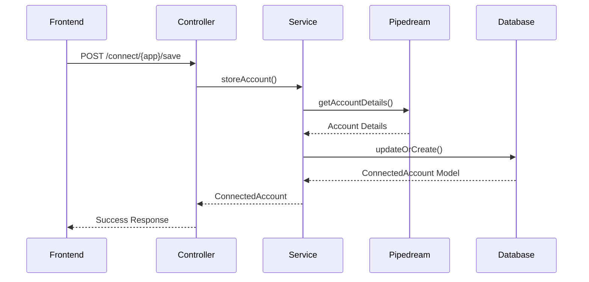

# Storing Connected Accounts

## Overview

This guide explains how to store and retrieve connected accounts using the PipedreamService and database models.

## Storage Flow



## Storing an Account

### Using PipedreamService

```php
use App\Services\PipedreamService;
use Illuminate\Support\Facades\Auth;

$service = new PipedreamService();
$user = Auth::user();

// Store account after OAuth flow completes
$account = $service->storeAccount(
    userId: $user->id,
    appName: 'gmail',
    accountId: 'apn_xxxxx', // From Pipedream SDK response
    externalUserId: (string) $user->id,
    metadata: [
        'email' => 'user@example.com',
        // Additional metadata
    ]
);
```

### What Gets Stored

The `storeAccount` method stores the following data:

```php
[
    'user_id' => 1,
    'app_name' => 'gmail',
    'pipedream_account_id' => 'apn_xxxxx',
    'external_user_id' => '1',
    'metadata' => [
        'account_id' => 'apn_xxxxx',
        'app' => 'gmail',
        'connected_at' => '2025-11-11T21:49:20.000Z',
        // Full account details from Pipedream API
        'email' => 'user@example.com',
        'status' => 'connected',
        // ... other fields
    ],
    'is_active' => true,
    'created_at' => '2025-11-11T21:49:20.000000Z',
    'updated_at' => '2025-11-11T21:49:20.000000Z',
]
```

## Retrieving Stored Accounts

### Get Single Account

```php
$service = new PipedreamService();
$account = $service->getStoredAccount($userId, 'gmail');

if ($account) {
    $accountId = $account->pipedream_account_id;
    $metadata = $account->metadata;
    $isActive = $account->is_active;
}
```

### List All Accounts

```php
$accounts = $service->listStoredAccounts($userId);

foreach ($accounts as $account) {
    echo $account->app_name . ': ' . $account->pipedream_account_id;
    print_r($account->metadata);
}
```

### Using Controller Endpoint

```javascript
// Frontend
const response = await fetch('/connect/accounts');
const data = await response.json();

if (data.success) {
    data.accounts.forEach(account => {
        console.log(account.app, account.pipedream_account_id);
        console.log('Metadata:', account.metadata);
    });
}
```

## Return Values

### ConnectedAccount Model

```php
ConnectedAccount {
    id: 1
    user_id: 1
    app_name: "gmail"
    pipedream_account_id: "apn_xxxxx"
    external_user_id: "1"
    metadata: {
        "account_id": "apn_xxxxx",
        "app": "gmail",
        "connected_at": "2025-11-11T21:49:20.000Z",
        "email": "user@example.com",
        "status": "connected"
    }
    is_active: true
    created_at: "2025-11-11T21:49:20.000000Z"
    updated_at: "2025-11-11T21:49:20.000000Z"
}
```

### API Response Format

**GET /connect/accounts**

```json
{
    "success": true,
    "accounts": [
        {
            "id": 1,
            "pipedream_account_id": "apn_xxxxx",
            "app": "gmail",
            "external_user_id": "1",
            "metadata": {
                "account_id": "apn_xxxxx",
                "app": "gmail",
                "connected_at": "2025-11-11T21:49:20.000Z"
            },
            "is_active": true,
            "connected_at": "2025-11-11T21:49:20.000000Z",
            "updated_at": "2025-11-11T21:49:20.000000Z"
        }
    ]
}
```

**POST /connect/{app}/save**

```json
{
    "success": true,
    "message": "Gmail connected successfully!",
    "account": {
        "id": 1,
        "app_name": "gmail",
        "pipedream_account_id": "apn_xxxxx",
        "metadata": {...},
        "connected_at": "2025-11-11T21:49:20.000000Z"
    }
}
```

## Using Integration Config

### Get Available Integrations

```php
use App\Helpers\IntegrationHelper;

$integrations = IntegrationHelper::getAvailableIntegrations();

foreach ($integrations as $key => $integration) {
    echo $integration['display_name'];
    echo $integration['description'];
    echo $integration['category'];
}
```

### Check Integration Requirements

```php
if (IntegrationHelper::requiresPipedream('gmail')) {
    // Use Pipedream Connect SDK
}

if (IntegrationHelper::isValidIntegration('gmail')) {
    // Integration is available
}
```

### Get Integrations by Category

```php
$financeApps = IntegrationHelper::getIntegrationsByCategory('finance');
// Returns: stripe, quickbooks, xero, zoho, paypal, plaid
```

## Complete Example

```php
use App\Services\PipedreamService;
use App\Helpers\IntegrationHelper;
use Illuminate\Support\Facades\Auth;

// 1. Check if integration is available
if (!IntegrationHelper::isValidIntegration('gmail')) {
    return response()->json(['error' => 'Integration not available'], 404);
}

// 2. Store account after connection
$service = new PipedreamService();
$user = Auth::user();

$account = $service->storeAccount(
    userId: $user->id,
    appName: 'gmail',
    accountId: 'apn_xxxxx',
    externalUserId: (string) $user->id,
    metadata: []
);

// 3. Retrieve stored account
$storedAccount = $service->getStoredAccount($user->id, 'gmail');

// 4. Use account for API requests
$result = $service->makeApiRequest(
    accountId: $storedAccount->pipedream_account_id,
    method: 'GET',
    endpoint: 'https://gmail.googleapis.com/gmail/v1/users/me/messages'
);

// 5. List all connected accounts
$allAccounts = $service->listStoredAccounts($user->id);
```

## Database Queries

### Direct Model Usage

```php
use App\Models\ConnectedAccount;

// Get active account
$account = ConnectedAccount::where('user_id', $userId)
    ->where('app_name', 'gmail')
    ->where('is_active', true)
    ->first();

// Get all accounts for user
$accounts = ConnectedAccount::where('user_id', $userId)
    ->where('is_active', true)
    ->get();

// Access metadata
$email = $account->metadata['email'] ?? null;
$connectedAt = $account->metadata['connected_at'] ?? null;
```

## Frontend Usage

```typescript
// Load connected accounts
const loadAccounts = async () => {
    const response = await fetch('/connect/accounts');
    const data = await response.json();
    
    if (data.success) {
        const connectedApps = new Set(
            data.accounts.map((acc: any) => acc.app.toLowerCase())
        );
        // Use connectedApps to show connected status
    }
};

// Check if app is connected
const isConnected = connectedApps.has('gmail');
```

